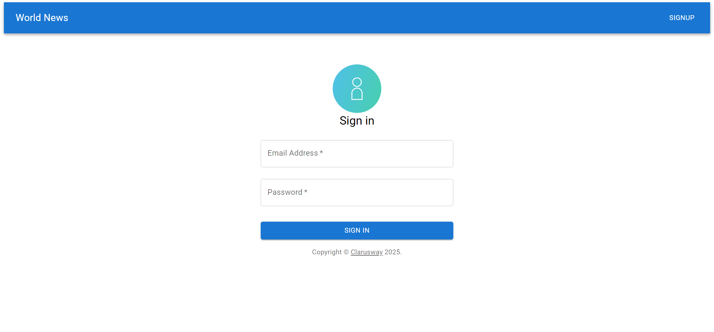
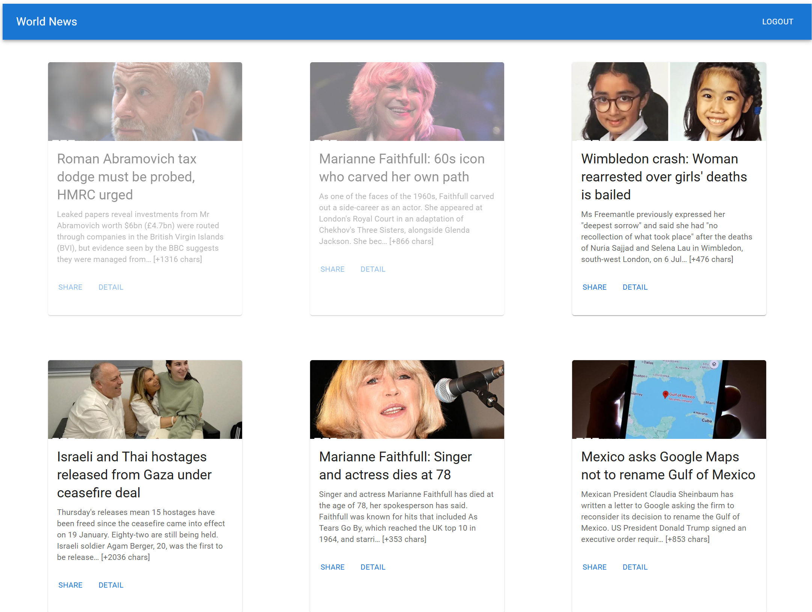

# World News App



This is a simple news application built with **React**, **Redux Toolkit**, and **Material-UI**. It allows users to view the latest news headlines from BBC News and provides basic user authentication functionality.

---

## Features

- **News Feed**: Fetches and displays the latest news headlines from BBC News using the **NewsAPI**.
- **User Authentication**: Users can log in with any email and password. The login state is managed using **Redux**.
- **Protected Routes**: Certain routes (e.g., the news feed) are protected and can only be accessed by logged-in users.
- **Shareable Links**: Users can copy the news article URL to share it with others.
- **Responsive Design**: The app is designed to be responsive and works well on both desktop and mobile devices.

---

## Technologies Used

- **React**: A JavaScript library for building user interfaces.
- **Redux Toolkit**: A toolset for efficient Redux development, used for state management.
- **Material-UI**: A popular React UI framework for designing responsive and attractive interfaces.
- **React Router**: A library for routing and navigation in React applications.
- **Axios**: A promise-based HTTP client for making API requests.

---

## How to Run the Project

1. **Clone the Repository**:
   ```bash
   git clone https://github.com/your-username/clarusway-news-app.git
   cd clarusway-news-app


## Project Structure

- src/components/: Contains reusable components like Navbar.

- src/features/: Contains Redux slices (yetkiSlice.jsx for authentication and haberSlice.jsx for news data).

- src/pages/: Contains the main pages of the app (Login.jsx and News.jsx).

- src/app/: Contains the Redux store configuration (store.jsx).

- src/AppRouter.jsx: Manages the routing and protected routes of the application.

## Key Functionality
- Login: Users can log in with any email and password. The login state is stored in Redux.

- News Feed: Displays the latest news headlines from BBC News. Users can click on "Detail" to view the full article in a new tab.

- Share: Users can copy the article URL by clicking the "Share" button. The button text changes to "Copied" temporarily after clicking.

- Logout: Users can log out, which clears their login state and redirects them to the login page.